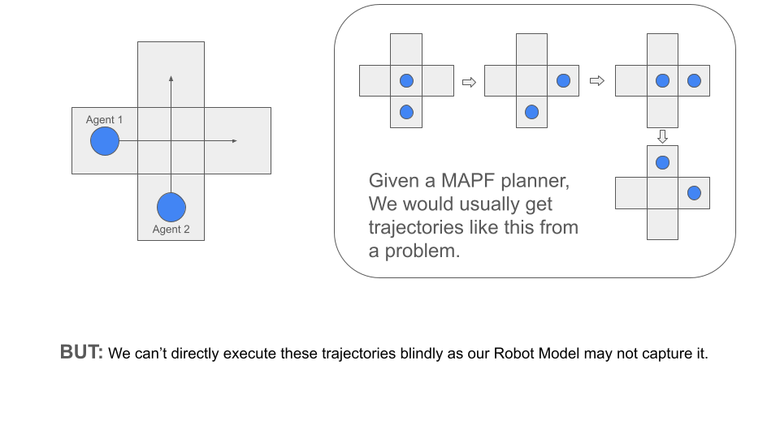
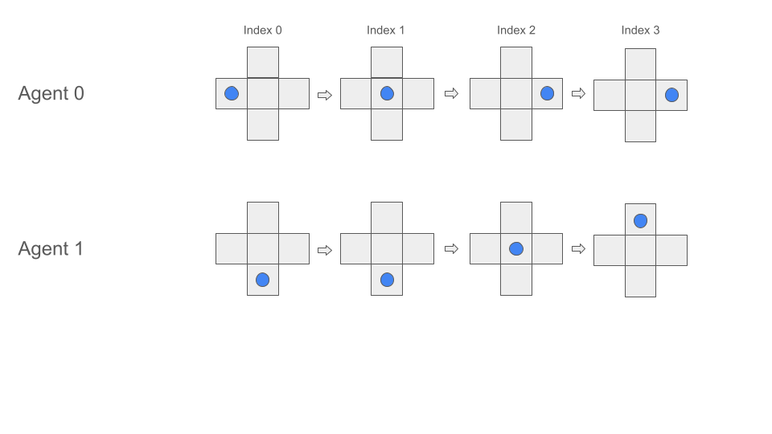
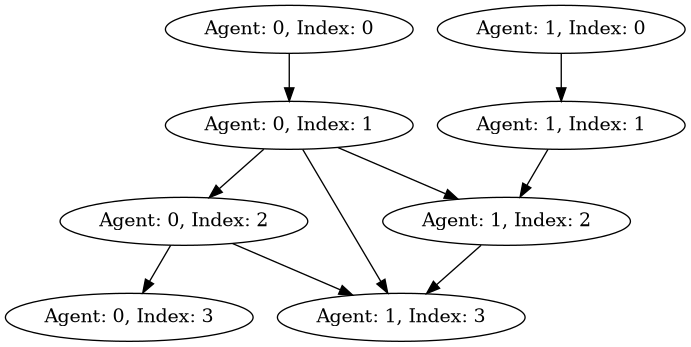

# MAPF-POST

:warning: Exprimental code, currently under construction

This Rust crate provides tools for extracting semantic plans from Multi-Agent Path Finding (MAPF) solutions. Executing MAPF plans in real-world robotic systems is a complex task, often hindered by both unknown robot model factors (e.g., imperfect kinematics, sensor noise) and dynamic environmental factors (such as unforeseen obstacles or changing layouts). By providing a high-level semantic representation of the plan, this crate significantly improves the feasibility and robustness for the practical execution of these MAPF plans.

## Example of what this means

Suppose two agents are supposed to cross a junction. MAPF solvers would output something like this:



However we can't directly execute these trajectories. This is due to the fact that robots may or maynot actually move to the appropriate locations. Occassionally, robot dynamics may not match the original plan based on time or introduction of obstacles may lead to

So given trajectories for each robot from a MAPF planner like so:




We would decompose the MAPF Planner trajectories into semantic dependencies using this library:



The original algorithm is outlined in:
```
W. Hönig, S. Kiesel, A. Tinka, J. W. Durham and N. Ayanian, "Persistent and Robust Execution of MAPF Schedules in Warehouses," in IEEE Robotics and Automation Letters, vol. 4, no. 2, pp. 1125-1131, April 2019, doi: 10.1109/LRA.2019.2894217. keywords: {Collision avoidance;Schedules;Robot kinematics;Task analysis;Robustness;Path planning for multiple mobile robots or agents;planning;scheduling and coordination;multi-robot systems;collision avoidance;factory automation},
```

We make some minor modifications in order to support heterogeneity by replacing the equality with a full collision check. Some day we may extend this to other configuration spaces, however this is the reason that we seem that Agent 1, index 2 must be executed after the completion of Agent 0 index 1. Additionally the algorithm recommends that Agent 0, index 2 - something which the original algorithm would not have captured as we need to be sure the robots have completely moved out.

Under the hood we are using rust's Parry Library for collision detection.